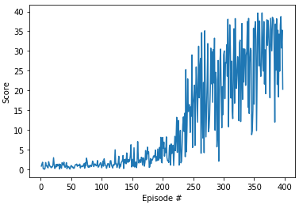

# Udacity Deep Reinforcment Learning Nanodegree 
## Project 2: Continuous Control Environment
 This is my implementation to sovle Continuous control Environment(Reacher) from Unity ML-Agents.

### Introduction

The goal for this project is to train an agent to navigate in a large, square world. In addition to navigation, the agent has to learn to collect yellow bananas, while avoiding the blue ones! 

| Screenshot of the environement | Obseravation State and Action  |
|---------------|-----------------|
|      | The environment has state space of 37(Vectorized space including agents velocity and the positions information of surrounding objects) and 4 discrete actions available: 0 - move forward. 1 - move backward. 2 - turn left. 3 - turn right.|

A reward of +1 is provided for collecting a yellow banana, and a reward of -1 is provided for collecting a blue banana.  

This task is episodic, and the condition to solve the environment is, to collect an average score of +13 or more, over 100 consecutive episodes.

You can learn more about the environment from the official Project instructions from Udacity [here](https://github.com/udacity/deep-reinforcement-learning/tree/master/p1_navigation)

### Setup Instructions:
#### 1. Requirements

To reproduce the results from this repository, it is suggested to use virtual python environment and python version 3.6. Python 3.7 at the point of creating this repository does not support tensorflow=1.7 which is a dependency of unityagents package. Note* Python3.7 can still be used, if you know how to install pacakages from source, change requirements.txt and use latest version of tensorflow(tested with tf-v1.14). Follow these simple steps to:

```shell
git clone https://github.com/AkhilSinghRana/ContinuousControl_RLProject.git

cd ContinuousControl_RLProject (cloned Repository root)

virtualenv env_name -p python3

source env_name/bin/activate #for linux or

env_name\Scripts\activate.bat #for Windows.


pip install -e .

 ```

Note*- Windows users might have problem installing torch, in this case install it from [https://pytorch.org/].
The above code will setup all the required dependencies for you. 

Next you need to download the unity environment for Reacher agent. Download the unity environment according to the OS you're using.
    Single Agent Links:
    - Linux: [click here](https://s3-us-west-1.amazonaws.com/udacity-drlnd/P2/Reacher/one_agent/Reacher_Linux.zip)
    - Mac OSX: [click here](https://s3-us-west-1.amazonaws.com/udacity-drlnd/P2/Reacher/one_agent/Reacher.app.zip)
    - Windows (32-bit): [click here](https://s3-us-west-1.amazonaws.com/udacity-drlnd/P2/Reacher/one_agent/Reacher_Windows_x86.zip)
    - Windows (64-bit): [click here](https://s3-us-west-1.amazonaws.com/udacity-drlnd/P2/Reacher/one_agent/Reacher_Windows_x86_64.zip)
    Multiple Agents Links(20 Agents):
    - Linux: [click here](https://s3-us-west-1.amazonaws.com/udacity-drlnd/P2/Reacher/Reacher_Linux.zip)
    - Mac OSX: [click here](https://s3-us-west-1.amazonaws.com/udacity-drlnd/P2/Reacher/Reacher.app.zip)
    - Windows (32-bit): [click here](https://s3-us-west-1.amazonaws.com/udacity-drlnd/P2/Reacher/Reacher_Windows_x86.zip)
    - Windows (64-bit): [click here](https://s3-us-west-1.amazonaws.com/udacity-drlnd/P2/Reacher/Reacher_Windows_x86_64.zip)
    
    
    
You are now ready to open the jupyter notebook for training and testing the Reacher agent!

#### 2. Testing/Loading model from checkpoint:

The checkpoint from my training is saved in Checkpoints [folder](./Checkpoints). Follow the instructions from the provided notebook. Test the trained agent and see the results.

``` jupyter notebook testReacherAgent.ipynb ```

#### 3. Train your own Agent:

Instructions for training your own agent is shown in below notebook.

``` jupyter notebook trainReacherAgent.ipynb  ```
 


### Results

The environment agent in this training was solved in 397 episodes! The algorithm used for training was DDPG. The results were achieved after a careful hyperparameter tuning, leading to a significant improvement. To read more about the algorithm, network architecture and hyper-Parameters settings read the [Report](./Report.pdf)

The training plot of the agent showing the scores improvement over the epsiodes is shown below.
 

